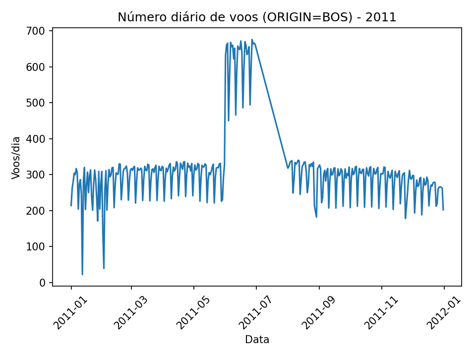

# Relatório - Spark (RDDs, DataFrames, SQL)
Gerado em: 2025-12-03T21:46:10
André Ichiro Katsurada

## Spark RDDs
### Q1) O que é RDD? Importância? Transformação vs Ação?
a) RDD é uma coleção distribuída e imutável, particionada no cluster e não otimizada por sí só.
b) Importância: paralelismo (partições), tolerância a falhas via lineage, e execução lazy.
c) Transformação (map/filter/etc.) produz nova RDD lazy; Ação (count/take/collect/etc.) dispara o job.

### RDD 2009 (amostra)

['FL_DATE', 'OP_CARRIER', 'OP_CARRIER_FL_NUM', 'ORIGIN', 'DEST', 'CRS_DEP_TIME', 'DEP_TIME', 'DEP_DELAY', 'TAXI_OUT', 'WHEELS_OFF', 'WHEELS_ON', 'TAXI_IN', 'CRS_ARR_TIME', 'ARR_TIME', 'ARR_DELAY', 'CANCELLED', 'CANCELLATION_CODE', 'DIVERTED', 'CRS_ELAPSED_TIME', 'ACTUAL_ELAPSED_TIME', 'AIR_TIME', 'DISTANCE', 'CARRIER_DELAY', 'WEATHER_DELAY', 'NAS_DELAY', 'SECURITY_DELAY', 'LATE_AIRCRAFT_DELAY', 'Unnamed: 27']

01: ('2009-01-01', '1204', '0.0', '')
02: ('2009-01-01', '1206', '0.0', '')
03: ('2009-01-01', '1207', '0.0', '')
04: ('2009-01-01', '1208', '0.0', '')
05: ('2009-01-01', '1209', '0.0', '')
06: ('2009-01-01', '1212', '0.0', '')
07: ('2009-01-01', '1212', '0.0', '')
08: ('2009-01-01', '1214', '0.0', '')
09: ('2009-01-01', '1215', '0.0', '')
10: ('2009-01-01', '1217', '0.0', '')

### Q2) Frase: "OP_CARRIER_FL_NUM" on "FL_DATE" was/was not cancelled
Exemplo de variável (string): `"1204" on "2009-01-01" was not cancelled.`

01: "1204" on "2009-01-01" was not cancelled.
02: "1206" on "2009-01-01" was not cancelled.
03: "1207" on "2009-01-01" was not cancelled.
04: "1208" on "2009-01-01" was not cancelled.
05: "1209" on "2009-01-01" was not cancelled.
06: "1212" on "2009-01-01" was not cancelled.
07: "1212" on "2009-01-01" was not cancelled.
08: "1214" on "2009-01-01" was not cancelled.
09: "1215" on "2009-01-01" was not cancelled.
10: "1217" on "2009-01-01" was not cancelled.

### Q3) Cancelados: "Flight NUMBER cancelled due to CODE"
Dicionário: A=Airline/Carrier, B=Weather, C=National Air System, D=Security.

01: Flight 7104 cancelled due to A (Airline/Carrier)
02: Flight 7329 cancelled due to A (Airline/Carrier)
03: Flight 7065 cancelled due to A (Airline/Carrier)
04: Flight 2984 cancelled due to B (Weather)
05: Flight 2823 cancelled due to B (Weather)
06: Flight 7344 cancelled due to A (Airline/Carrier)
07: Flight 2798 cancelled due to B (Weather)
08: Flight 2939 cancelled due to B (Weather)
09: Flight 4537 cancelled due to A (Airline/Carrier)
10: Flight 4537 cancelled due to A (Airline/Carrier)

## Spark DataFrame (2011.csv)
### Amostra do DataFrame (primeiras 10 linhas)
```text
+----------+----------+-----------------+------+----+------------+--------+---------+--------+----------+---------+-------+------------+--------+---------+---------+-----------------+--------+----------------+-------------------+--------+--------+-------------+-------------+---------+--------------+-------------------+-----------+------------+
|FL_DATE   |OP_CARRIER|OP_CARRIER_FL_NUM|ORIGIN|DEST|CRS_DEP_TIME|DEP_TIME|DEP_DELAY|TAXI_OUT|WHEELS_OFF|WHEELS_ON|TAXI_IN|CRS_ARR_TIME|ARR_TIME|ARR_DELAY|CANCELLED|CANCELLATION_CODE|DIVERTED|CRS_ELAPSED_TIME|ACTUAL_ELAPSED_TIME|AIR_TIME|DISTANCE|CARRIER_DELAY|WEATHER_DELAY|NAS_DELAY|SECURITY_DELAY|LATE_AIRCRAFT_DELAY|Unnamed: 27|FL_DATE_DATE|
+----------+----------+-----------------+------+----+------------+--------+---------+--------+----------+---------+-------+------------+--------+---------+---------+-----------------+--------+----------------+-------------------+--------+--------+-------------+-------------+---------+--------------+-------------------+-----------+------------+
|2011-01-01|MQ        |4529             |BOS   |JFK |1830        |1823.0  |-7.0     |68.0    |1931.0    |2019.0   |30.0   |2000        |2049.0  |49.0     |0.0      |NULL             |0.0     |90.0            |146.0              |48.0    |187.0   |0.0          |0.0          |49.0     |0.0           |0.0                |NULL       |2011-01-01  |
|2011-01-01|MQ        |4532             |BNA   |DCA |1100        |1052.0  |-8.0     |11.0    |1103.0    |1317.0   |3.0    |1335        |1320.0  |-15.0    |0.0      |NULL             |0.0     |95.0            |88.0               |74.0    |562.0   |NULL         |NULL         |NULL     |NULL          |NULL               |NULL       |2011-01-01  |
|2011-01-01|MQ        |4532             |DCA   |JFK |1400        |1358.0  |-2.0     |9.0     |1407.0    |1507.0   |4.0    |1519        |1511.0  |-8.0     |0.0      |NULL             |0.0     |79.0            |73.0               |60.0    |213.0   |NULL         |NULL         |NULL     |NULL          |NULL               |NULL       |2011-01-01  |
|2011-01-01|MQ        |4537             |RDU   |JFK |1710        |1706.0  |-4.0     |59.0    |1805.0    |1930.0   |15.0   |1855        |1945.0  |50.0     |0.0      |NULL             |0.0     |105.0           |159.0              |85.0    |426.0   |0.0          |0.0          |50.0     |0.0           |0.0                |NULL       |2011-01-01  |
|2011-01-01|MQ        |4540             |CMH   |LGA |1340        |1340.0  |0.0      |14.0    |1354.0    |1511.0   |4.0    |1525        |1515.0  |-10.0    |0.0      |NULL             |0.0     |105.0           |95.0               |77.0    |478.0   |NULL         |NULL         |NULL     |NULL          |NULL               |NULL       |2011-01-01  |
|2011-01-01|MQ        |4558             |LGA   |CLE |955         |951.0   |-4.0     |15.0    |1006.0    |1130.0   |5.0    |1150        |1135.0  |-15.0    |0.0      |NULL             |0.0     |115.0           |104.0              |84.0    |418.0   |NULL         |NULL         |NULL     |NULL          |NULL               |NULL       |2011-01-01  |
|2011-01-01|MQ        |4559             |LGA   |CMH |1100        |1100.0  |0.0      |21.0    |1121.0    |1257.0   |8.0    |1305        |1305.0  |0.0      |0.0      |NULL             |0.0     |125.0           |125.0              |96.0    |478.0   |NULL         |NULL         |NULL     |NULL          |NULL               |NULL       |2011-01-01  |
|2011-01-01|MQ        |4568             |BNA   |DCA |1625        |1659.0  |34.0     |36.0    |1735.0    |1942.0   |3.0    |1900        |1945.0  |45.0     |0.0      |NULL             |0.0     |95.0            |106.0              |67.0    |562.0   |0.0          |0.0          |11.0     |0.0           |34.0               |NULL       |2011-01-01  |
|2011-01-01|MQ        |4572             |CLE   |LGA |1220        |1215.0  |-5.0     |9.0     |1224.0    |1331.0   |9.0    |1355        |1340.0  |-15.0    |0.0      |NULL             |0.0     |95.0            |85.0               |67.0    |418.0   |NULL         |NULL         |NULL     |NULL          |NULL               |NULL       |2011-01-01  |
|2011-01-01|MQ        |4575             |CLT   |LGA |1615        |1608.0  |-7.0     |11.0    |1619.0    |1738.0   |18.0   |1810        |1756.0  |-14.0    |0.0      |NULL             |0.0     |115.0           |108.0              |79.0    |544.0   |NULL         |NULL         |NULL     |NULL          |NULL               |NULL       |2011-01-01  |
+----------+----------+-----------------+------+----+------------+--------+---------+--------+----------+---------+-------+------------+--------+---------+---------+-----------------+--------+----------------+-------------------+--------+--------+-------------+-------------+---------+--------------+-------------------+-----------+------------+
only showing top 10 rows

### Q1) Faixas de distância e proporção (%) de voos com atraso
Cortes (aprox.): p33=416.00, p66=859.00

Definição de atraso usada: `(DEP_DELAY > 0) OR (ARR_DELAY > 0)` (cancelados excluídos).

Verificação: totais=(1969687, 1971404, 2009523) (soma=5950614), atrasados=(912501, 945112, 1068857) (soma=2926470)

+-------------+-------------+---------------+---------+
|distance_band|total_flights|delayed_flights|delay_pct|
+-------------+-------------+---------------+---------+
|proximos     |1969687      |912501         |46.33    |
|medio        |1971404      |945112         |47.94    |
|distantes    |2009523      |1068857        |53.19    |
+-------------+-------------+---------------+---------+

### Q2) Visualização: número diário de voos com origem BOS
Gráfico salvo em: `./daily_flights.png`



+------------+-------------+
|FL_DATE_DATE|daily_flights|
+------------+-------------+
|2011-01-01  |214          |
|2011-01-02  |262          |
|2011-01-03  |281          |
|2011-01-04  |304          |
|2011-01-05  |300          |
|2011-01-06  |317          |
|2011-01-07  |304          |
|2011-01-08  |204          |
|2011-01-09  |274          |
|2011-01-10  |286          |
+------------+-------------+
only showing top 10 rows

## Spark SQL
### Q6) Operadoras mais pontuais em média (atraso total saída+chegada)
Métricas:
- `avg_total_delay_raw_min`: média de `DEP_DELAY + ARR_DELAY` (pode ser negativa)
- `avg_total_delay_pos_min`: média de `max(DEP_DELAY,0) + max(ARR_DELAY,0)` (apenas tardança)

#### Ranking por tardança (avg_total_delay_pos_min)
+----------+-----------------------+-----------------------+-------+
|OP_CARRIER|avg_total_delay_raw_min|avg_total_delay_pos_min|flights|
+----------+-----------------------+-----------------------+-------+
|HA        |0.05                   |8.04                   |66371  |
|AS        |-1.62                  |11.99                  |142284 |
|FL        |6.47                   |17.22                  |245173 |
|YV        |6.94                   |18.45                  |152094 |
|US        |8.54                   |18.84                  |401601 |
|DL        |8.72                   |19.37                  |719245 |
|OO        |11.76                  |21.33                  |572927 |
|F9        |14.39                  |21.94                  |84539  |
|WN        |15.33                  |22.29                  |1141769|
|UA        |11.4                   |23.16                  |305240 |
+----------+-----------------------+-----------------------+-------+

#### Ranking por atraso 'bruto' (avg_total_delay_raw_min)
+----------+-----------------------+-----------------------+-------+
|OP_CARRIER|avg_total_delay_raw_min|avg_total_delay_pos_min|flights|
+----------+-----------------------+-----------------------+-------+
|AS        |-1.62                  |11.99                  |142284 |
|HA        |0.05                   |8.04                   |66371  |
|FL        |6.47                   |17.22                  |245173 |
|YV        |6.94                   |18.45                  |152094 |
|US        |8.54                   |18.84                  |401601 |
|DL        |8.72                   |19.37                  |719245 |
|UA        |11.4                   |23.16                  |305240 |
|OO        |11.76                  |21.33                  |572927 |
|MQ        |14.04                  |24.08                  |429262 |
|F9        |14.39                  |21.94                  |84539  |
+----------+-----------------------+-----------------------+-------+

### Q7) Aeroporto com mais atrasos por questões de clima
+-------+-----------------------+--------------------------+
|airport|total_weather_delay_min|flights_with_weather_delay|
+-------+-----------------------+--------------------------+
|ORD    |180733.0               |3105                      |
|DFW    |149029.0               |3408                      |
|ATL    |128933.0               |2734                      |
|IAH    |74271.0                |1497                      |
|DEN    |70495.0                |1595                      |
|LAX    |70369.0                |1602                      |
|EWR    |67982.0                |1341                      |
|LGA    |67478.0                |1415                      |
|SFO    |64779.0                |1264                      |
|PHL    |61841.0                |1256                      |
+-------+-----------------------+--------------------------+

Resposta: **Aeroporto (DEST) com maior atraso total por clima: ORD com 180733.0 min**

Configs:
- 2009: `/Users/akatsurada/Documents/INSPER/BigData/checkpoint/2009.csv`
- 2011: `/Users/akatsurada/Documents/INSPER/BigData/checkpoint/2011.csv`
- Plot: `./daily_flights.png`
- Report: `./spark_answers.md`
- Master: `local[2]`
- Spark log level: `ERROR`
- spark.sql.debug.maxToStringFields: `2000`