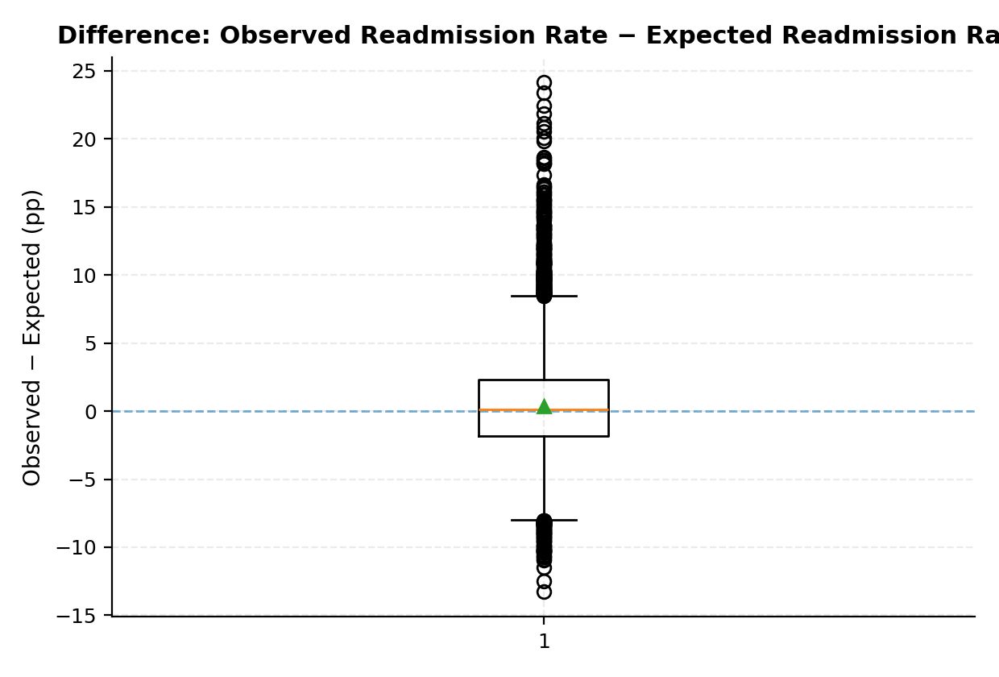
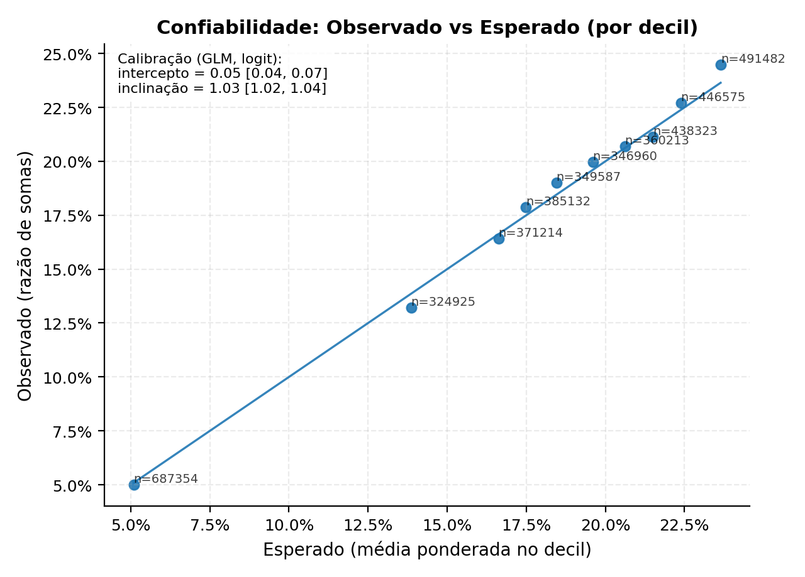
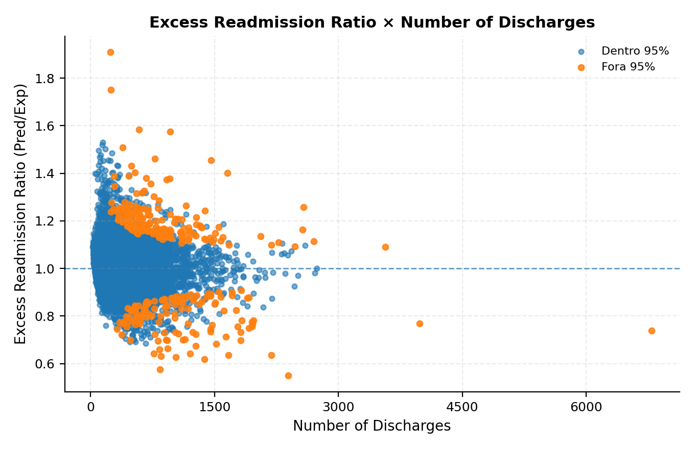
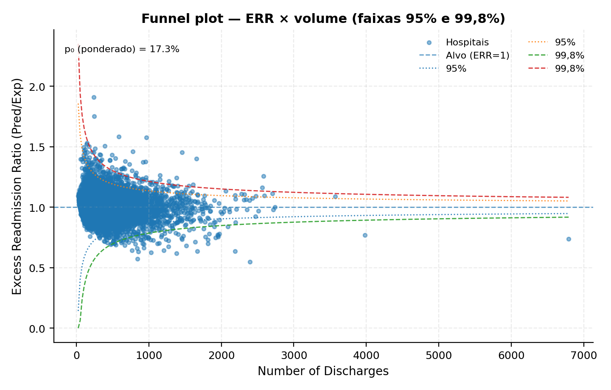
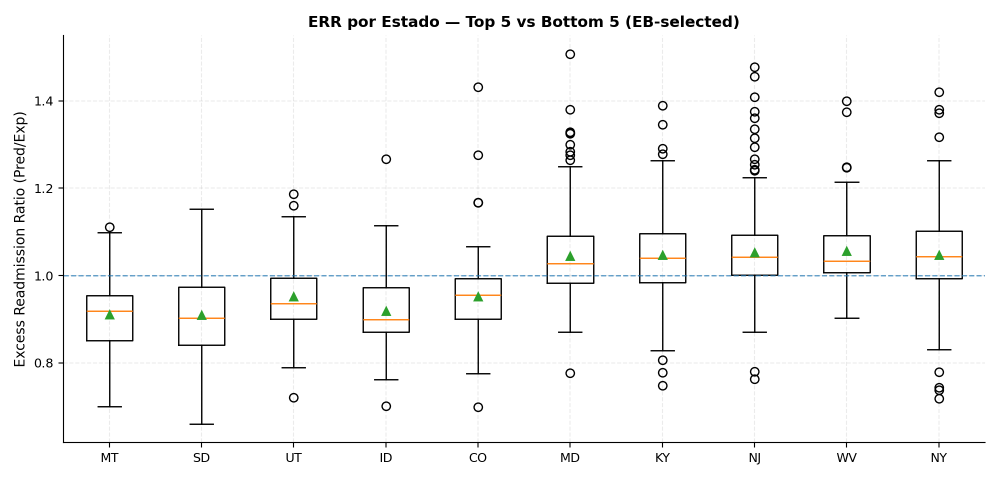

# Readmissões em Hospitais Medicare — Lista 02 (Resumo)

As figuras citadas abaixo estão nesta mesma pasta. Clique para abrir em tamanho maior.

---

## 1) Difference: Observed Readmission Rate − Expected Readmission Rate

A maioria dos hospitais está muito perto do zero (diferença pequena).

A mediana fica levemente abaixo de zero e a média levemente acima: sinal de que, em geral, o esperado e o observado batem, mas há assimetrias pequenas.

Existem poucos hospitais bem acima (+15 a +25 p.p.) e alguns bem abaixo (até uns −13 p.p.). Essas bolinhas são exceções.

**Como interpretar**
No geral, o que se esperava está alinhado com o que aconteceu. Porém, há casos extremos (para melhor e para pior) que merecem análise individual.

---

## 2) Confiabilidade: Observado vs Esperado (por decil)

Os pontos ficam quase colados na diagonal. Traduzindo o texto no canto: “começa quase no lugar certo” e “sobe quase com a inclinação certa”. Há leve tendência do observado ficar um pouco acima do esperado nas faixas mais altas, mas é desvio pequeno.

**Como interpretar**
O seu “GPS” de expectativa está bem calibrado: quando o risco esperado aumenta, o observado aumenta na mesma medida. Pequenos desvios não mudam a história principal.

---

## 3) Excess Readmission Ratio × Number of Discharges

O que os dados mostram

Hospitais pequenos espalham mais (pontos altos e baixos).

Hospitais grandes ficam mais perto de 1 (o esperado).

Há alguns pontos laranja tanto acima quanto abaixo — inclusive com volumes médios/grandes.

**Como interpretar**
Cuidado ao julgar hospitais com poucos casos: a medida oscila mais. Já em volumes maiores, sair muito de 1 chama mais atenção, porque ali a oscilação natural é bem menor.

---

## 4) Funnel plot — ERR × volume (faixas 95% e 99,8%)

O que os dados mostram

Maioria dos hospitais dentro da faixa de 95%.

Poucos saem para fora das faixas mais rígidas (99,8%) — esses são os que mais valem investigação.

**Como interpretar**
Este é um painel de triagem: priorize os pontos fora das faixas, principalmente quando o volume é médio/alto (pois aí a chance de ser só “sorte ou azar” é pequena).

---

## 5) ERR por Estado — Top 5 vs Bottom 5 (EB‑selected)

Melhores (à esquerda): MT, SD, UT, ID, CO — em geral abaixo de 1, com o grosso dos hospitais desses estados performando melhor que o esperado.

Piores (à direita): MD, KY, NJ, WV, NY — em geral acima de 1, com mais hospitais pior que o esperado; há outliers altos (alguns bem acima de 1,3–1,4).

A altura das caixas e das “antenas” mostra a variação dentro do estado: alguns têm dispersão maior (mais desigualdade entre hospitais).

**Como interpretar**
Há tendências por estado: um grupo consistentemente melhor e outro pior que o esperado. As diferenças típicas não são gigantes; ainda assim, outliers e estados com vários hospitais acima de 1 merecem planos de ação. Do outro lado, estados à esquerda podem render boas práticas para copiar.
