# Exercício (1a): Frequência de `Negotiation Type`

### O que foi feito
- Padronizei labels básicos (ex.: 'aluguel' → 'rent') e contei.
- Mostra o **Total** (c/ missing e s/ missing).

### Frequências — Original (como no CSV, com *Missing*)
|Categoria (raw) | Freq. Absoluta| Freq. Relativa|     %|
|:---------------|--------------:|--------------:|-----:|
|rent            |           7228|       0.529912| 52.99|
|sale            |           6412|       0.470088| 47.01|

### Frequências — Normalizadas (com *Missing*)
|Categoria | Freq. Absoluta| Freq. Relativa|     %|
|:---------|--------------:|--------------:|-----:|
|rent      |           7228|       0.529912| 52.99|
|sale      |           6412|       0.470088| 47.01|

### Frequências — Normalizadas (sem *Missing*)
|Categoria | Freq. Absoluta| Freq. Relativa|     %|
|:---------|--------------:|--------------:|-----:|
|rent      |           7228|       0.529912| 52.99|
|sale      |           6412|       0.470088| 47.01|

### Interpretação
- Registros: **13640**.
- Missing em `Negotiation Type`: **0 (0%)**.
- Categoria que mais aparece: **rent** (52.99% dos válidos).
# Exercício 1b: Dispersão do preço do condomínio (Condo) e do preço anunciado (Price)

### O que foi feito
- Dispersão com **cor pela densidade**
- Escalas **log–log** e **linha do ajuste**
- Cortes **visuais** 1%–99% pra não achatar.

### Gráfico
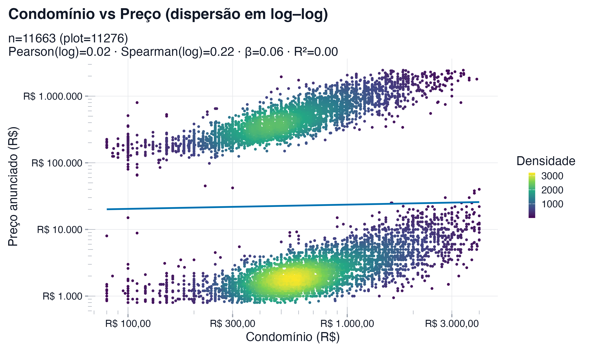

### Métricas (sem cortes de percentil)
- Pearson (log): 0.019
- Spearman (log): 0.216
- Elasticidade (log–log): 0.064 · efeito de +10% no condomínio ≈ 0.6%
- R² (log–log): 0.000
- Pontos limpos: 11663 (de 13640); no desenho: 11276).

### Interpretação
- **Relação positiva, mas fraca**: condomínio maior tende a preço maior, c/ bastante variação.
# Exercício 1c: Dispersão com facetas por `Negotiation Type` (rent vs sale)

### O que foi feito
- Dispersão com **cor pela densidade** **e** **linha do ajuste** em cada faceta.
- Cortes **visuais** 1%–99% por faceta; **eixos iguais**
- Escalas **log–log** com **limites iguais**

### Gráfico (dispersão em log–log, com linha do ajuste)
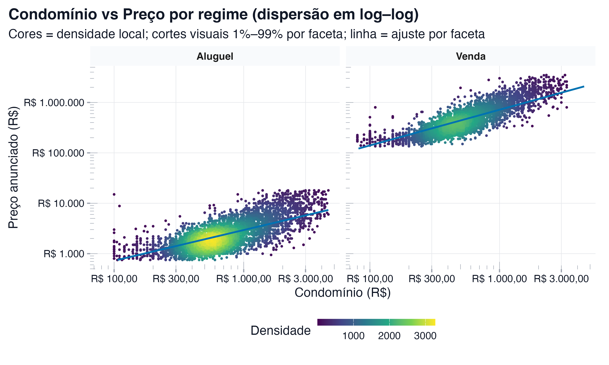

### Números por regime (sem cortes nos cálculos)
|Tipo    |    n| Pearson| Spearman| Elasticidade (log–log)| R² (log–log)|Variação no preço |
|:-------|----:|-------:|--------:|----------------------:|------------:|:-----------------|
|Aluguel | 6588|   0.695|    0.731|                  0.609|        0.483|6%                |
|Venda   | 5075|   0.789|    0.869|                  0.709|        0.623|7%                |
## Painel combinado — Patchwork (B)

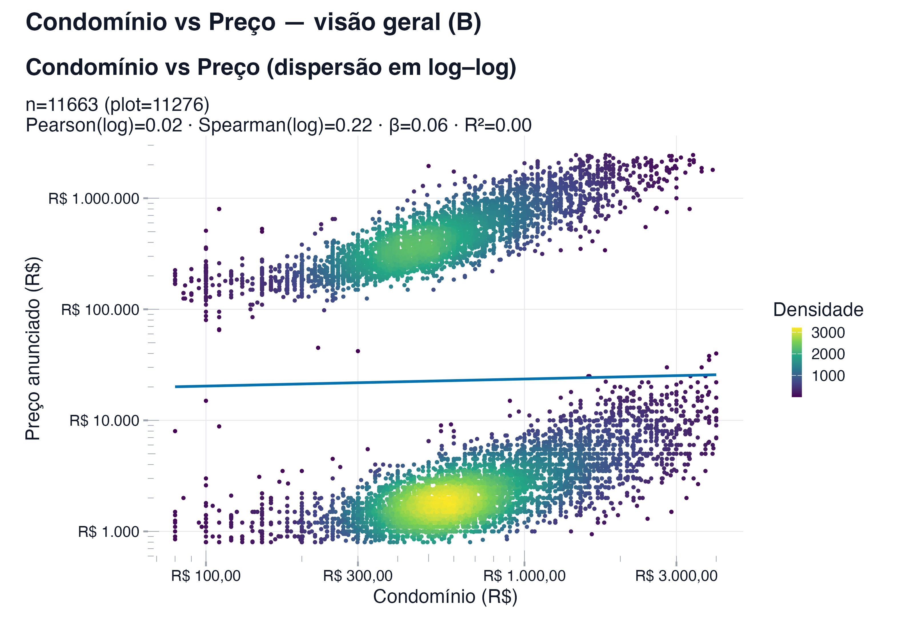

## Painel alternativo — Paleta cividis (B)

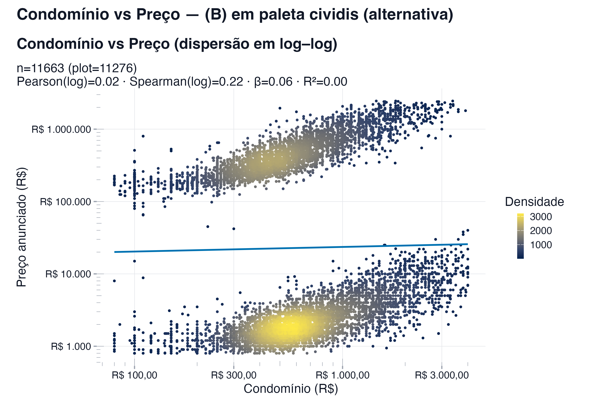

# Exercício 1d: Top 10 distritos por frequência

### O que foi feito
- Limpei sufixos (ex.: '/São Paulo', '- SP') e juntei grafias parecidas.
- Usei a grafia mais comum como label

- Registros com distrito válido: **13640** (de 13640); Missing: **0 (0%)**.

### Tabela — Top 10
|Distrito          | Freq. Absoluta| Freq. Relativa|    %|
|:-----------------|--------------:|--------------:|----:|
|Moema             |            293|          0.021| 2.15|
|Mooca             |            288|          0.021| 2.11|
|Brás              |            255|          0.019| 1.87|
|Bela Vista        |            250|          0.018| 1.83|
|Brooklin          |            250|          0.018| 1.83|
|Pinheiros         |            249|          0.018| 1.83|
|Casa Verde        |            248|          0.018| 1.82|
|Cambuci           |            241|          0.018| 1.77|
|Perdizes          |            236|          0.017| 1.73|
|Alto de Pinheiros |            230|          0.017| 1.69|

### Gráfico — Frequências
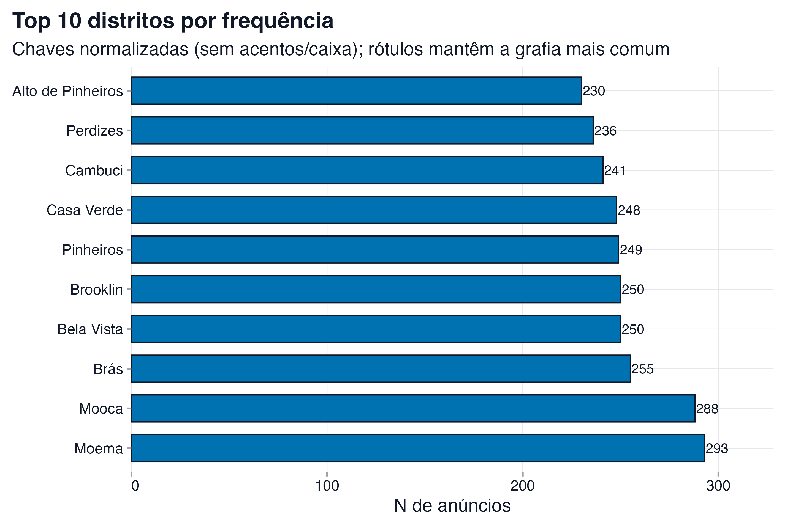
# Exercício 1e (i–vi): OLS, Ridge, LASSO, Elastic Net, Árvore e Floresta (rent)

### Setup
- Amostra: **rent**; Price > 0; *hold-out* **80%/**20%** (seed=12345).
- Teste efetivamente usado: **1343/1343** linhas (após alinhamento de dummies).
- **Alvo**: `log1p(Price)`; Fórmula base: `log1p(Price) ~ .`.
- Tunning: `glmnet` k=5 (lambda.1se); **Árvore** 1‑SE (cp=0.00156); **Floresta** `ranger` (ntree=300, mtry=4, importance=none, threads=9).
- **Elastic Net**: grade de α = {0.1, 0.3, 0.5, 0.7, 0.9}; α* selecionado = **0.90**.
- `District` reduzido via `forcats::fct_lump_n(n=50)`.
- Coordenadas filtradas p/ SP (lat -24.5..-23.2, lon -47.4..-46).

### Métricas (teste — mesma amostra)
|Modelo                           |RMSE        |MAE         |    R2|  RMSLE|lambda    |#coef≠0 |
|:--------------------------------|:-----------|:-----------|-----:|------:|:---------|:-------|
|Floresta (ranger)                |R$ 2.024,44 |R$ 790,36   | 0.693| 0.2832|—         |—       |
|Linear (OLS)                     |R$ 2.099,54 |R$ 873,47   | 0.669| 0.3264|—         |62      |
|Árvore (1-SE)                    |R$ 2.273,99 |R$ 1.012,86 | 0.612| 0.3582|—         |—       |
|Ridge (lambda.1se)               |R$ 2.364,30 |R$ 1.020,95 | 0.581| 0.3778|6.836e-01 |62      |
|LASSO (lambda.1se)               |R$ 2.425,43 |R$ 1.137,02 | 0.559| 0.4151|6.526e-02 |12      |
|Elastic Net (α=0.90, lambda.1se) |R$ 2.428,83 |R$ 1.138,79 | 0.557| 0.4159|7.251e-02 |12      |

### Gráficos
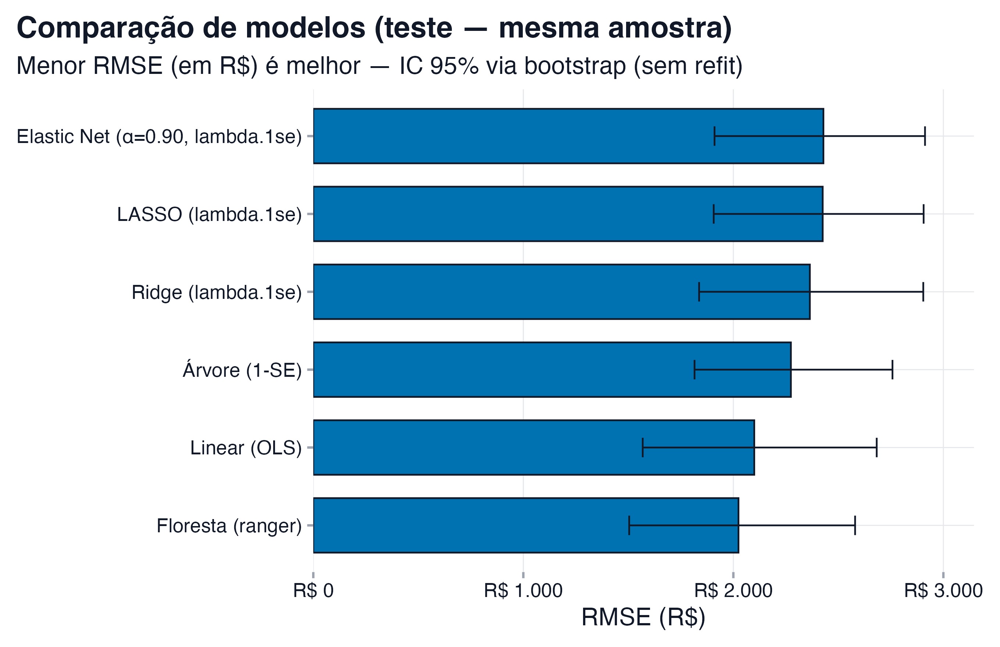

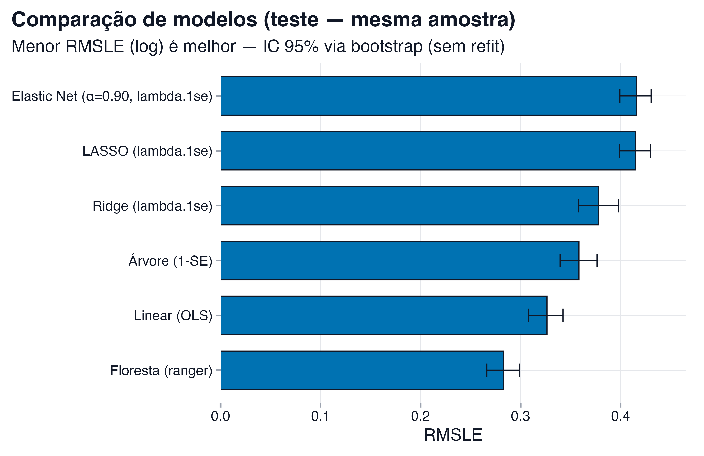

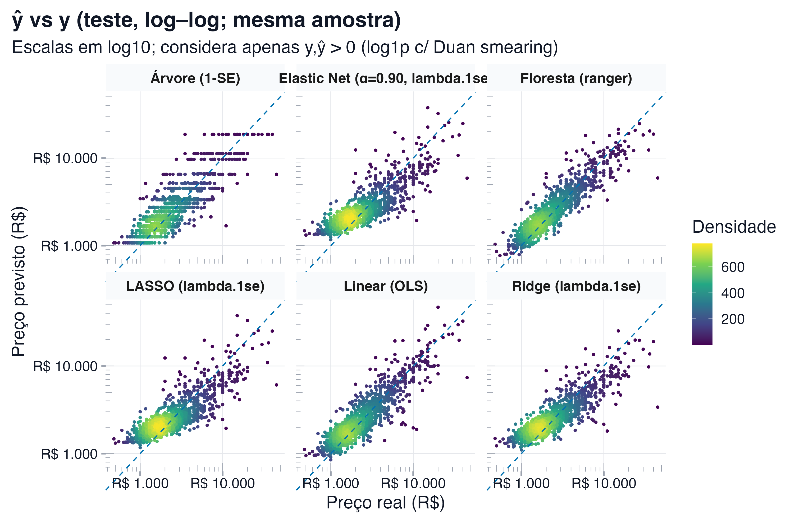

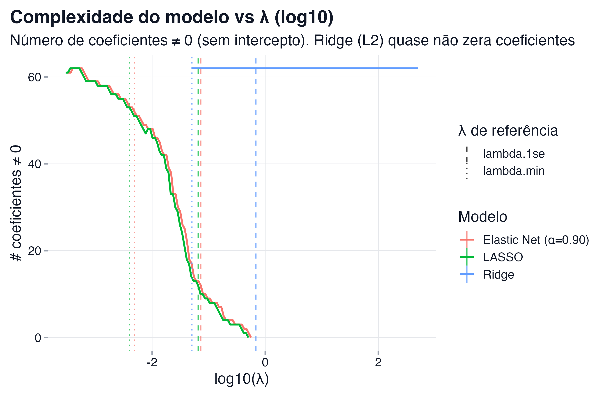

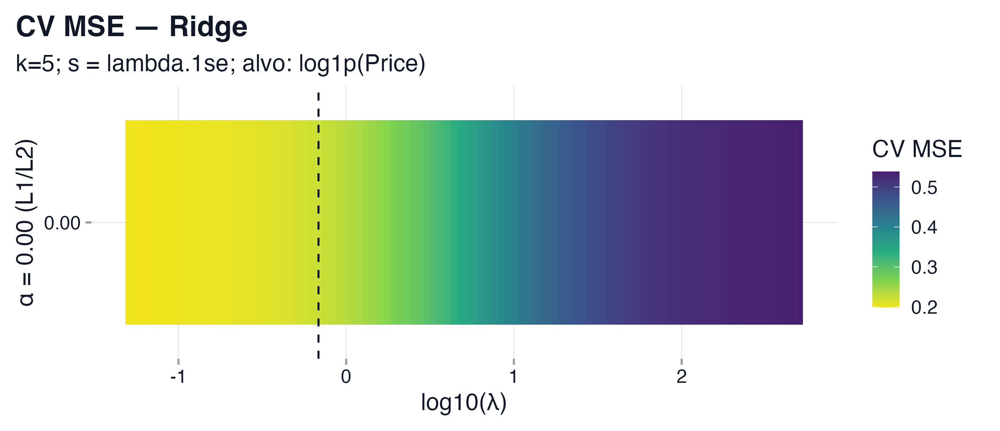

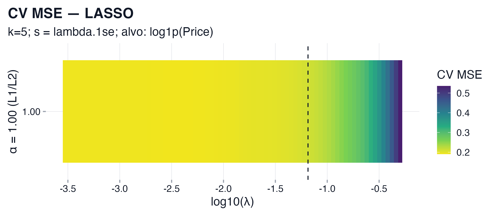

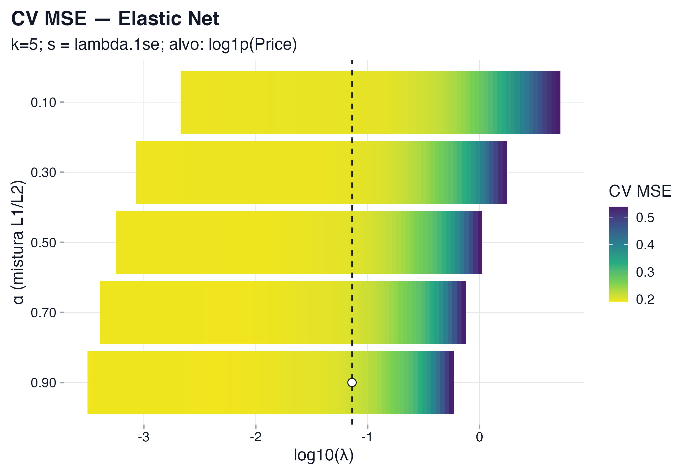

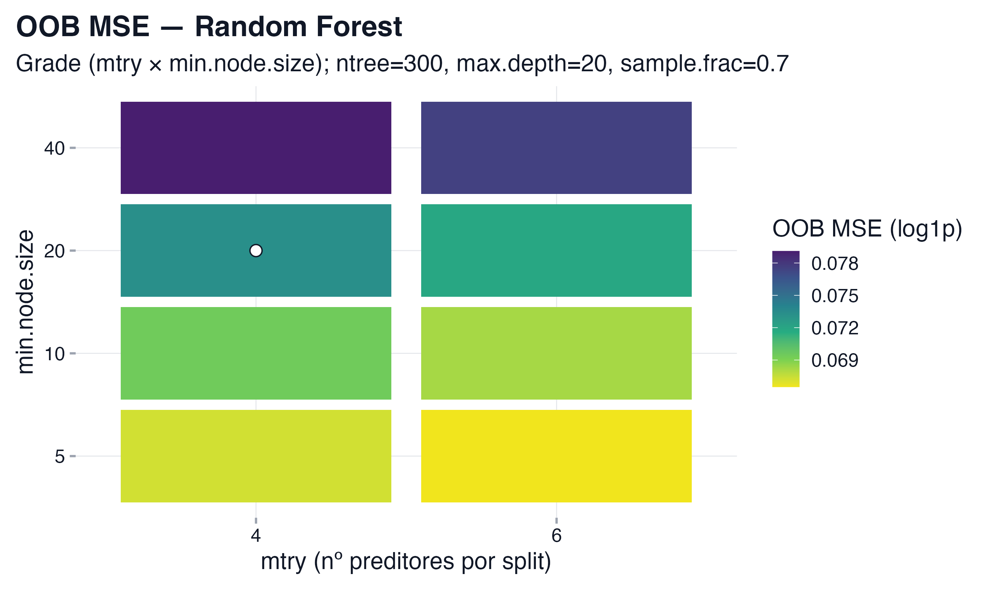

### Notas
- Sem cluster PSOCK: evita travamentos em macOS. `ranger` segue multi‑thread.
- Para resultados finais, rode `run(fast = FALSE)` (10‑fold + importance = permutation).
